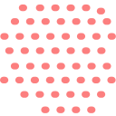
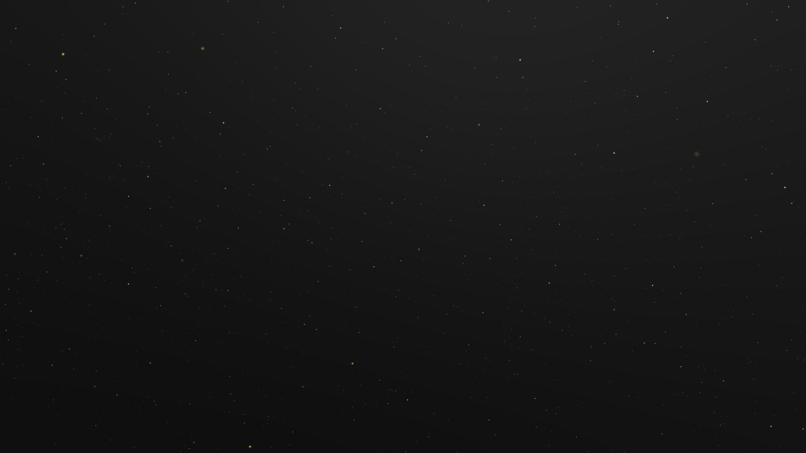

# Dust3D

A simple way to add dust to a 3d scene!

This was taken from perfoon's Abandoned Spaceship Godot Demo:

https://github.com/perfoon/Abandoned-Spaceship-Godot-Demo

I made the dust it's own scene that can be added to any other 3d scene in Godot!

Created by Jonnie Gieringer
